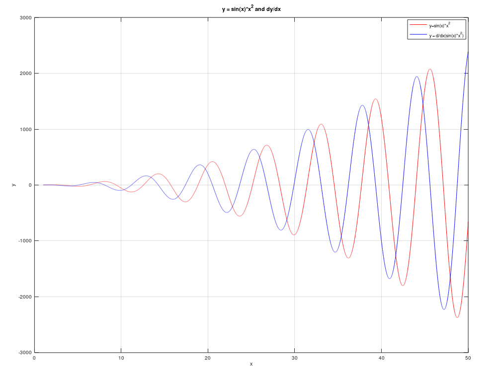

# Краткое руководство по языку Matlab

## Работа в консоли, выполнение скриптов.

Работа в интерактивном интерпритаторе выполняется так же, как и при обычном наборе скриптов. Пишите выражение, оно выполняется. Если не указывать переменную, в которую записывается результат операции, то он будет записан в глобальную переменную `ans`. Чтобы запретить вывод результата выражения, нужно добавить после него `;`.
Команды для очистки экрана и переменных:

* `clc` - очистить экран

* `clear var_name1 ... var_nameN` - очистить переменные `var_name1 ... var_nameN`

* `clear all` - очистить все переменные

* `clr` - `clear all; close all; clc;`

## Наиболее часто использующиеся типы данных и создание переменных

Наиболее используемые типы данных в Matlab:

* Число с плавающей точкой *double* 

  * `x = 5;`

* Строка *string*

  * `x = "string";`

  Расширение GNU Octave:

  * `x = 'string';`

* *Матрица* - все типы данных хранятся в матричной форме

  * `x = [ 0 1 2];` - матрица 1х3

  * `x = 1;` - матрица 1х1

  * `x = [ 0 1 2; 3 4 5; 6 7 8];` - матрица 3x3

* Указатель на функцию *function_handle*

  * более подробно рассмотрен в разделе "Создание и работа с функциями"

## Операции над переменными

Matlab поддерживает следующие операции:

1. Арифметические операции

* `a + b` - сложение матриц одной размерности

* `a - b` - вычитание матриц одной размерности

* `a * b` - умножение, где a - матрица NхM, b - матрица MxL

* `a .* b` - поэлементное умножение матриц

* `a ^ b` - возведение в степень, где a - матрица NхN, b - матрица 1х1

* `a.^b` - поэлементное возведение матрицы в степень

* `a / b` - деление матриц слева направо (X=B/A есть решение X*A=B)

* `a \ b` - деление матриц справа налево (X=A\B есть решение A*X=B)

* `a ./ b` - поэлементное деление слева направо

* `a .\ b` - поэлементное деление справа налево 

* `sqrt(x)` - квадратный корень

Расширения GNU Octave:

* инкремент: `x++`, `++x`

* декремент: `x--`, `--x`

* операции с присвоением: `+=`, `-=`, `*=`, `\=`

2. Операции отношения

* равно: `==`

* не равно: `~=`

* меньше: `<`

* больше: `>`

* меньше или равно: `<=`

* больше или равно: `>=`

3. Логические операции

* И: `&`

* ИЛИ: `|`

* НЕ: `~`

* исключающее ИЛИ: `xor(a, b)`

3. Тригонометрические функции

* обычные: `sin(x), cos(x), tan(x), cot(x), sec(x), csc(x)` 

* обратные: `asin(x), acos(x), atan(x), acot(x), asec(x), acsc(x)`

* гиперболические: `sinh(x), cosh(x), tanh(x), coth(x), sech(x), csch(x)`

* обратные гиперболические: `asinh(x), acosh(x), atanh(x), acoth(x), asech(x), acsch(x)`

4. Экспоненциальные и логарифмические функции

* по основанию e: `exp(x), log(x)`

* по основанию 10: `log10(x)`

* по основанию 2: `log2(x), pow2(x)`

5. Округление и остаток от деления

* `fix(x)` Округление до ближайшего целого в сторону нуля 

* `floor(x)` Округление до ближайшего целого в сторону отрицательной бесконечности 

* `ceil(x)` Округление до ближайшего целого в сторону положительной бесконечности 

* `round(x)` Округление до ближайшего целого 

* `mod(x)` Остаток от целочисленного деления с учетом знака 

* `rem(x)` Остаток от целочисленного деления по модулю 

* `sign(x)` Определение знака числа

* `abs(x)` Модуль числа

6. Операции с массивами - нумерация начинается с 1

* `array(i, j, ...)` - вернет элемент (i, j, ...)

* `array(:, j)` - вернет столбец j массива array

* `[ a b ]` - конкатенация массивов

* `A'` - траспонирует матрицу A

* `size(A)` - получить размер матрицы А

* `zeros(M,N)` - генерирует нулевую матрицу MxN

* `eye(N, M)` - генерирует матрицу NxM, у которой на диагонали k стоят единицы (k>0 - верхние диагонали отностиельно центральной, k<0 - нижние), а на всех остальных местах нули

* `ones(M, N)` - генерирует матрицу MxN из единиц

7. Работа со специальными значениями

* `NaN` - не число

* `Inf` - бесконечность

* `isnan(x)` - проверка на NaN

* `isinf(x)` - проверка на Inf

* `pi` - число Пи

## Операции вывода на экран

|Функция | Параметры | Описание|
|--- | --- | ---|
|`disp(x)` | Переменная | Вывод х на экран|
|`fprintf(formatSpec,A1,...,An)` | A1,..., An - переменные, formatSpec - формат вывода | Форматированный вывод переменных A1,..., An|

Символы форматирования, которые могут использоваться в formatSpec:

|Символ|Описание|
|---|---|
|%d|Десятичное число|
|%e, %f, %g|Число с плавающей точкой|
|%i|Целое число со знаком|
|%o|Восьмеричное число со знаком|
|%u|Десятичное целое число со знаком|
|%x|Шестнадцатеричное целое число со знаком|

## Циклы и условные переходы

* Условие:

```matlab
if expression
    statements
elseif
    statements
...
else
    statements
end
```

* Switch-case:

```matlab
switch switch_expr
    case case_expr1
        statement, ..., statement
    ...
    case case_exprn
        statement, ..., statement
    otherwise
        statement, ..., statement
end
```

* Цикл for (values - вектор значений):

```matlab
for index = values
   statements
end
```

* Цикл While:

```matlab
while condition
   statements
end
```

Расширения GNU Octave:

* Цикл do-while:
```perl
do
   statements
until (condition)
```

## Создание функций

Функции должны создаваться в отдельном файле с расширением *.m*. Для примера ниже: *out1, ..., outN* - выходные параметры, *myfun* - название функции, *in1, ..., inN* - входные параметры

```matlab
function [out1,out2, ..., outN] = myfun(in1,in2,in3, ..., inN)
    statements
end
```
Для создания ссылки на функцию используется оператор `@`: `f = @function_name;`
Также функцию можно создавать с помощью оператора `@`: `@(x1..xn)(y)`. Например:
```matlab
f = @(x,y) x^2 + y^2;
p = f(4,4) % p = 32
```
## Функции для работы с файлами

`f = fopen(file_name, mode)` — открытие файла (по умолчанию файл открывается в двоичном режиме)
`fclose(f)` - закрытие файла после работы с ним
`flose('all')` - закрывает все открытые файлы
`mode` может принимать комбинацию следующих значений:

| Режим | Обозначение |
| --- | --- |
|'r'|открытие на чтение (является значением по умолчанию)|
|'w'|открытие на запись, содержимое файла удаляется, если файла не существует, создается новый |
|'x'|открытие на запись, если файла не существует, иначе исключение |
|'a'|открытие на дозапись, информация добавляется в конец файла|
|'b'|открытие в двоичном режиме|
|'t'|открытие в текстовом режиме (является значением по умолчанию)|
|'+'|открытие на чтение и запись|

`A = fread(f,size,precision)` - считывает двоичные данные из заданного файла и помещает их в матрицу `А` c точностью `precision`. `size` — аргумент, определяющий количество считываемых данных. Если аргумент `size` не определен, функция `fread` считывает данные до конца файла.

`fwrite(f,A,precision)` - записывает элементы матрицы `А` в файл с заданной точностью `precision`. Данные записываются в файл по столбцам. Добавляет символы «возврат каретки» перед началом новой строки

`fprintf(f,format,A)` - форматирует данные, содержащиеся в действительной части матрицы `А`, под контролем строки format и записывает их в файл.

`A = fscanf(f,format,size)` - считывает количество данных, определенное параметром `size` и преобразует их в соответствии с параметром `format`. Параметр `size` - это произвольный аргумент, определяющий количество считываемых данных. Допустимы следующие значения:

* `n` - чтение п элементов в вектор-столбец

* `inf` - чтение элементов до конца файла и помещение их в вектор-столбец, содержащий такое же количество элементов, что и в файле;

* `[m,n]` - считывает столько элементов, сколько требуется для заполнения матрицы размера mхn. Заполнение происходит по столбцам.


## Функции построения графиков

Наиболее часто использующуеся функции для построения графиков:

### Двухмерная и трехмерная графика 

|Функция | Параметры | Описание| 
|--- | --- | ---|
|`figure(number)` | Номер окна для графика | Создать окно для фигуры №number. Не обязательная команда, если используется только одно окно для графика|
|`grid` | on / off | Показать сетку на графике|
|`hold` | on / off | Не стирать старые графики. По умолчанию каждый новый график затирает все предыдущее|
|`axis([xmin, xmax,  ymin,  ymax])` | Масштабы по осям координаты | Выставить масштабы графика|
|`title(title)` | Строка заголовка | Вывести заголовок графика|
|`xlabel(x)` | Строка подписи | Вывести подпись к оси x|
|`ylabel(y)` | Строка подписи | Вывести подпись к оси y|
|`legend(legend1,...,legendN)` | Строки, описывающие график | Вывести легенду на график|
|`fplot(function,x,linespec)`|function - функция, заданная в виде @(x)y, x - промежуток, linespec - спецификация графиков|Нарисовать функцию|
|`plot(X1,Y1,LineSpec1,...,Xn,Yn,LineSpecN)` | Пары (X, Y) - массивы точек x и y соответственно, массивы должны быть одной размерности, LineSpec - спецификации графиков | Нарисовать график по точкам |
|`plot3(X1,Y1,Z1,LineSpec,...)` | Пары (X, Y, Z) - массивы точке x, y и z соответственно, массивы должны быть одной размерности, LineSpec - спецификации графиков | Нарисовать трехмерный график по точкам|
|`mesh(X,Y,Z)` | Массивы точек | Нарисовать трехмерную поверхность, окраска зависит от значений|
|`loglog(x, y)` | Массивы переменных | Логарифмический масштаб|
|`polar(phi,r)` | Массивы переменных | Полярные координаты|
|`stairs(x,y)` | Массивы переменных | График в виде ступенчатой линии|
|`hist(y, x)` | Массивы переменных | Гистограмма|
|`bar(x, y)` | Массивы переменных | Столбчатая диаграмма|

### Спецификации линий

|Тип линии | Тип точки | Цвет|
| --- | --- | ---|
|Непрерывная 	- | Точка 	. | Желтый 	y|
|Штриховая 	-- | Плюс 	+ | Фиолетовый 	m|
|Двойной пунктир 	: | Звездочка 	* | Голубой 	c|
|Штрих-пунктирная 	-. | Кружок 	o | Красный 	r|
|| Крестик 	х | Зеленый 	g|
||| Синий 	b|
||| Белый 	w|
||| Черный 	k|

Пример построения графика:
```matlab
x = 1:0.01:50;
y1 = sin(x).*x.^2;
y2 = x.*2.*sin(x)+x.*cos(x);
grid on % отобразить сетку на графике
hold on % удерживать рисунок
plot(x,y1,'r') %нарисовать график функции y1 красным цветом
plot(x, y2, 'b') %нарисовать график функции y2 синим цветом
xlabel('x') %подписать ось абсцисс
ylabel('y') %подписать ось ординат
title('График функции sin(x)*x^2 и ее производной') %добавить заголовок графику
legend('y=sin(x)*x^2', 'y = d/dx(sin(x)*x^2)') %указать на картинке подписи к графикам 
```



## Статистические функции.

* `randn(M,N)` вернет матрицу MxN c нормально распределенными элементами с матожиданием 0 и дисперсией 1

* `rand(M,N)` вернет матрицу MxN c равномерно распределенными элементами на интервале (0, 1)

* `mean(x)` возвращает матожидание матрицы x

* `var(x)` возвращает дисперсию матрицы x

## Функции решения дифференциальных задач.

```matlab
[t Y] = ode23('f', t, Y0)
[t Y] = ode45('f', t, Y0)
[t Y] = ode23(@f, t, Y0)
[t Y] = ode45(@f, t, Y0)
```

Где f - функция, Y0 - набор начальных условий, t - вектор значений переменной
Пример:

```matlab
function f1 = f(t, y)
    alfa = 0.8; beta = 0.3; c = 0.5; d = 0.2;
    f1 = [((alfa – c * y(2)) * y(1)); ((-beta + d * y(1)) * y(2))];
end
[t Y] = ode45('f', [0 100], [1 2]);
```

## Ссылки

* https://www.mathworks.com/store/link/products/student/new - купить Matlab

* https://www.gnu.org/software/octave/ - скачать GNU Octave

* https://www.mathworks.com/help/matlab/ - официальный сайт с документацией

* http://old.exponenta.ru/ - документация на русском (устаревшая)