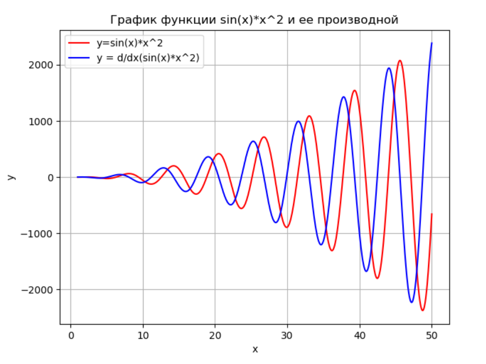

# Краткое руководство по языку Python

## Работа в консоли, выполнение скриптов.

Работа в интерактивном интерпритаторе выполняется так же, как и при обычном наборе скриптов. Пишите выражение, оно выполняется. Если не присваивать результат выражения переменной, то она выведется в консоль. Чтобы выйти из консольного режима, используйте команду `quit()` или сочетание клавиш `Ctrl+Z Enter`. Чтобы очистить вывод, используйте команду `clear()`. Для очистки переменной используется команда `del var_name`.
Для выполнения скрипта из консоли используйте команду `python script_name.py`. Если на вашем компьютере установлено две версии Python (2.x и 3.x), нужно указать нужную версию: `python3 script_name.py`. Для установки необходимых библиотек используйте команду `pip install lib_name`. Если вы хотите подключить свой скрипт `sctipt_name.py` к другому скрипту, если они лежат в одной папке, используйте команду `import scrtipt_name`. Если хотите создать подключаемую библиотеку, нужно в папке с этой библиотекой создать файл `__init__.py`. Тогда подключение скрипта с адресом `package/script.py` будет выглядеть так: `import package`.

Так же для работы над курсом математического моделирования вам понадобятся библиотеки *numpy*, *scipy* и *matplotlib*. Далее в тексте используются сокращения:

```python
import numpy as np
import matplotlib.pyplot as plt
from scipy import integrate
from mpl_toolkits import mplot3d
```

## Наиболее часто использующиеся типы данных и создание переменных

Типы данных, которые рекомендуется использовать в курсе:

* Число с плавающей точкой *float*

  * `x = 5.4`

* Целочисленный тип *int*

  * `x = 5`

* Строка *str*

  * `x = "string"`

  * `x = 'string'`

* Кортеж *tuple*

  * `x = (1, 2)`

* Список *list*

  * `x = [ 0, 1, 2 ]` - массив 1х3

  * `x = [ [0, 1, 2], [3, 4, 5], [6, 7, 8] ]` - альтернатива двухмерному массиву 3x3

* массив *numpy.array* 

  ```python
  >>> np.array([1, 2, 3.0])
  array([ 1.,  2.,  3.])
  ```

  ```python
  >>> np.array([[1, 2], [3, 4]])
  array([[1, 2],
        [3, 4]])
  ```

* Указатель на функцию *function*

  * более подробно рассмотрен в разделе "Создание и работа с функциями"

## Операции над переменными

Python поддерживает следующие операции:

1. Арифметические операции

  * `a + b` - сложение

  * `a - b` - вычитание

  * `a * b` - умножение

  * `a / b` - деление 

  * `a // b` - деление нацело

  * `a ** b` - возведение в степень

  * `a % b` - остаток от деления

  * операции с присвоением: `+=`, `-=`, `*=`, `\=`

2. Операции отношения

  * равно: `==`

  * не равно: `!=`

  * меньше: `<`

  * больше: `>`

  * меньше или равно: `<=`

  * больше или равно: `>=`

3. Логические операции

  * И: `and`

  * ИЛИ: `or`

  * НЕ: `not`

4. Тригонометрические функции

  * обычные: `np.sin(x), np.cos(x), np.tan(x)` 

  * обратные: `np.arcsin(x), np.arccos(x), np.arctan(x)`

  * гиперболические: `np.sinh(x), np.cosh(x), np.tanh(x)`

  * обратные гиперболические: `np.arcsinh(x), np.arccosh(x), np.arctanh(x)`

5. Экспоненциальные и логарифмические функции

  * по основанию e: `np.exp(x), np.log(x)`

  * по основанию 10: `log10(x)`

  * по основанию 2: `log2(x), exp2(x)`

6. Округление и остаток от деления

  * `np.floor(x)` Округление до ближайшего целого в сторону отрицательной бесконечности 

  * `np.ceil(x)` Округление до ближайшего целого в сторону положительной бесконечности 

  * `np.round(x)` Округление до ближайшего целого 

  * `np.abs(x)` Модуль числа

7. Операции с массивами - нумерация начинается с 0

  * `list[i]` - вернет i-й элемент списка

  * `array[i, j]` - вернет элемент (i,j) массива array

  * `array[:, j]` - вернет столбец j массива array

  * выполнить действие над элементами списка:

  ```python
  list(map(lambda x: statement), list)
  ```

8. Работа со специальными значениями

  * `np.nan` - не число

  * `np.inf` - бесконечность

  * `np.isnan(x)` - проверка на NaN

  * `np.isinf(x)` - проверка на Inf

  * `np.pi` - число Пи

## Операции вывода на экран

|Функция | Параметры | Описание|
|--- | --- | ---|
|`print(x)` | Переменная | Вывод х на экран|
|`formatSpec.format(A1,...,An)` | A1,..., An - переменные, formatSpec - формат вывода | Форматированный вывод переменных A1,..., An|
|`f{formatSpec{A1}...formatSpec{An}}` | A1,..., An - переменные, formatSpec - формат вывода | Форматированный вывод переменных A1,..., An|

## Циклы и условные переходы

* Условие:

```python
if expression:
    statements
elif expression:
    statements
...
else:
    statements
```

* Цикл for:

```python
for i in valuesrange:
   statements
```

  для создания диапазона значений используются функции:

  * создает диапазон `[start, stop)` c целочисленным шагом `step`

  ```python
  range(start, stop, step)
  ```

  * создает диапазон `[start, stop)` c шагом `step`

  ```python
  np.arange(start, stop, step)
  ```

  * создает диапазон `[start, stop)` c шагом `(stop-start)/num`

  ```python
  np.linspace(start, stop, num)
  ```

* Цикл While:

```python
while condition:
   statements
```

## Создание функций

Функции можно создавать в любом месте.

* обычные функции

```python
def function(in1,in2,in3, ..., inN):
    statements
    return out
```

* лямбда-выражения

```python
lambda in1,in2,in3, ..., inN: statement
```

## Функции построения графиков

Функции для построения графиков:

### Двухмерная графика

|Функция | Параметры | Описание |
|--- | --- | ---|
|`plt.figure(number)` | Номер окна для графика | Создать окно для фигуры №number. Не обязательная команда, если используется только одно окно для графика|
|`plt.grid()` | --- | Показать сетку на графике|
|`plt.axis([xmin, xmax,  ymin,  ymax])` | Масштабы по осям координаты | Выставить масштабы графика|
|`plt.title(title)` | Строка заголовка | Вывести заголовок графика|
|`plt.xlabel(x)` | Строка подписи | Вывести подпись к оси x|
|`plt.ylabel(y)` | Строка подписи | Вывести подпись к оси y|
|`plt.legend(legend1,...,legendN)` | Строки, описывающие график | Вывести легенду на график|
|`plt.plot(X1,Y1,LineSpec1,...,Xn,Yn,LineSpecN)` | Пары (X, Y) - массивы точек x и y соответственно, массивы должны быть одной размерности, LineSpec - спецификации графиков | Нарисовать график по точкам |
|`plt.loglog(x, y)` | Массивы переменных | Логарифмический масштаб|
|`plt.polar(phi,r)` | Массивы переменных | Полярные координаты|
|`plt.stairs(x,y)` | Массивы переменных | График в виде ступенчатой линии|
|`plt.hist(y, x)` | Массивы переменных | Гистограмма|
|`plt.bar(x, y)` | Массивы переменных | Столбчатая диаграмма|
|`plt.show()` | | Показать график|

### Трехмерная графика

|Функция | Параметры | Описание |
|--- | --- | ---|
|`ax = plt.axes(projection='3d')`||Трехмерное пространство|
|`ax.plot3D(x, y, z, linespec)`|x, y, z - массивы значений, должны быть одной размерности, linespec - спецификация графика|Нарисовать график в трехмерном пространстве|
|`ax.set_xlabel('x')`, `ax.set_ylabel('y')`, `ax.set_zlabel('z')`|Подписи к осям|Подписать оси x, y и z соответственно|
|`ax.set_title(title)`|Строка заголовка|Вывести заголовок графика|

### Спецификации линий

|Тип линии | Тип точки | Цвет|
|--- | --- | ---|
|Непрерывная 	- | Точка 	. | Желтый 	y|
|Штриховая 	-- | Плюс 	+ | Фиолетовый 	m|
|Двойной пунктир 	: | Звездочка 	* | Голубой 	c|
|Штрих-пунктирная 	-. | Кружок 	o | Красный 	r|
|| Крестик 	х | Зеленый 	g|
||| Синий 	b|
||| Белый 	w|
||| Черный 	k|

Пример построения графика:
```python
x = np.linspace(1, 50, 1000)
y1 = np.sin(x)*np.square(x)
y2 = x*(2*np.sin(x)+x*np.cos(x))
plt.grid() #отобразить сетку на графике
plt.plot(x,y1,'r') #нарисовать график функции y1 красным цветом
plt.plot(x, y2, 'b') #нарисовать график функции y2 синим цветом
plt.xlabel('x') #подписать ось абсцисс
plt.ylabel('y') #подписать ось ординат
plt.title('График функции sin(x)*x^2 и ее производной') #добавить заголовок графику
plt.legend(['y=sin(x)*x^2', 'y = d/dx(sin(x)*x^2)']) #указать на картинке подписи к графикам 
plt.show() #отобразить графики
```



## Статистические функции.

* `np.random.randn(M,N)` - вернет матрицу MxN c нормально распределенными элементами с матожиданием 0 и дисперсией 1

* `np.random.normal(m, s, size = (M,N))` - вернет матрицу MxN c нормально распределенными элементами с матожиданием m и среднеквадратичным отклонением s

* `np.random.uniform(A,B, (M, N))` - вернет матрицу MxN c равномерно распределенными элементами на отрезке (A,B)

## Функции для решения матричных уравнений.

```python
np.linalg.solve(a,b) 
#решение уравнения aX = b
#a матрица MxL, b - матрица MxN
#возвращаемое значение X - матрица LxN 
```

```python
np.zeros((M,N)) #генерирует нулевую матрицу MxN
```

```python
np.eye(N, M=None, k=0) # генерирует матрицу NxM, у которой на диагонали k стоят единицы 
#(k>0 - верхние диагонали отностиельно центральной, k<0 - нижние), а на всех остальных местах нули
```

```python
np.ones((M, N)) #генерирует матрицу MxN из единиц
```

```python
np.concatenate((a, b, ...)) # конкатенация массивов
```

```python
np.transpose(m) #транспонирование матрицы m
```

```python
np.square(m) # возвести элементы матрицы в квадрат 
```

```python
np.sqrt(m) # взять квадратный корень от элементов
```

```python
np.dot(a,b) # умножить a на b
```

## Функции решения дифференциальных задач.

```python
integrate.odeint(f, Y0, t) 
#решение уравнения Y' = f(y, Y', t)
#f - функция или лямбда-выражение, Y0 - набор начальных условий, t - вектор значений переменной
#возвращаемое значение - вектор Y'
```

Пример:

Решение системы ДУ первого порядка

```python
def f(y, t):
    alfa = 0.8; beta = 0.3; c = 0.5; d = 0.2
    return [((alfa - c*y[1])*y[0]), ((-beta + d*y[0])*y[1])]
t = np.linspace(0, 100, 10000)
Y = integrate.odeint(f, [1, 2], t)
```
